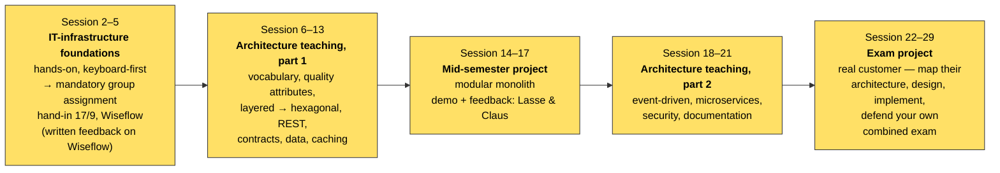

# Session 1: Introduction to 3rd semester

**ITA Software Architecture 2026 Fall | ~1.5–2 hours, after the shared 3rd-semester welcome | Toolkit setup (hands-on)**

> The shared welcome covered the semester, the schedule, and your groups. This is where *this* course starts. This semester you'll spend more time **reading** code with an AI coding agent than writing it from scratch — that's the method, not a gimmick. Today isn't teaching yet: it's getting the tool onto your laptop and watching it work for the first time.

---

## Before Class

- No preparation for this class.

---

## Today's Teachings

### Part 1 — Why an agent, and why reading over writing (10 min) — blackboard
Architecture is easiest to see in large, real systems — and the fastest way to learn to spot it is to read real systems yourself, with help. With an AI coding agent we can open, search, and get explanation of a codebase far faster than you can alone, but we only learn something if we keep checking its claims against the actual code. That checking habit starts today and runs the whole semester.

A quick look at where this is going — two real systems the semester anchors on. Just the shape for now, no explanation; that's the rest of the semester:

[](https://github.com/Ek-Ita-Swa-Iti/mistral-vibe-ek-ita)
[](https://github.com/go-gitea/gitea)

### Part 2 — The semester at a glance (10 min) — blackboard
Before we install anything, the map of what's ahead:



Once we're past the foundations block, every teaching session follows the same rhythm: before class → compare notes with a partner → today's teachings, anchored on a real codebase → an in-class exercise → after class, ask your agent a question and verify it against the code yourself.

The full session-by-session breakdown lives in [`curriculum.md`](../curriculum.md), in the repo root — worth bookmarking.

### Part 3 — Install Mistral Vibe (25 min) — keyboard
Mistral Vibe is this semester's primary agent — the one every later session assumes is already working. Official quickstart: <https://docs.mistral.ai/mistral-vibe/terminal/quickstart>.

**macOS / Linux:**

```bash
curl -LsSf https://mistral.ai/vibe/install.sh | bash
```

**Windows (PowerShell):** install `uv` first, then Vibe with it:

```powershell
powershell -ExecutionPolicy ByPass -c "irm https://astral.sh/uv/install.ps1 | iex"
```

```powershell
uv tool install mistral-vibe
```

On first launch, Vibe creates `~/.vibe/config.toml` and asks for an API key. Create one at <https://console.mistral.ai/codestral/cli> and paste it in — it's saved to `~/.vibe/.env`.

### Part 4 — Other agents in the wild (10 min) — blackboard + discussion
Mistral Vibe is what this course standardises on, but it isn't the only CLI coding agent out there. **Claude Code** (Anthropic) is another example of one you might wanna use — some of you may end up preferring it, and comparing two tools against the same codebase is a good habit anyway. Beyond those two, the field moves fast: **[Cursor's CLI](https://cursor.com)**, **[GitHub Copilot CLI](https://github.com/features/copilot)**, **[Aider](https://aider.chat)**, **[Codex](https://openai.com/codex)**, **[Gemini CLI](https://geminicli.com/)**, **[Qwen Code](https://github.com/QwenLM/qwen-code)**, and others, with new ones shipping constantly. They differ in interface but converge on the same idea — an LLM that reads your code, plans, and runs commands, while you check its work. If you want to set one up alongside Vibe, do it on your own time; that's not today's task.

[](https://docs.claude.com/en/docs/claude-code)
[](https://cursor.com)
[](https://github.com/features/copilot)
[](https://aider.chat)
[](https://openai.com/codex)
[](https://geminicli.com/)
[](https://github.com/QwenLM/qwen-code)

### Part 5 — Demo: watch an agent read a codebase it's never seen (20 min) — instructor demo
Let's point Vibe at a real, unfamiliar codebase and ask something like: *"what does this project do, and how is it organised?"* Watch what it actually does — it opens files, searches, and reads, out loud, the same way you would. No magic. (You'll get a proper, hands-on tour of this exact codebase in Session 6 — today is just a first look.)

### Part 6 — First contact: you try it (15 min) — keyboard
Point Vibe at any project already on your laptop — something from an earlier semester, a personal repo, whatever you've got. Ask it one plain-English question: *"what does this do?"* is plenty. Nothing to hand in — the only goal is that it works, and that you've seen it work, before the semester needs it to.

You can choose a repository of your own preference, or you can try one of these. `git clone` it, `cd` into the folder, and type `vibe`.

- **[Flask](https://github.com/pallets/flask)** — a small, well-known Python web framework.
- **[Express](https://github.com/expressjs/express)** — a small, well-known Node.js web framework.
- **[Ktor](https://github.com/ktorio/ktor)** — a Kotlin web framework (the same one you'll use hands-on in Sessions 8 & 9).

### Part 7 — This repo is yours to improve too (5 min) — blackboard
Everything you're reading — this README, every session's material — lives in a public GitHub repo: `EK_ITA_SWA_2026_fall`. If you spot a typo, a broken command, a dead link, or a section that's just unclear, **fork it and open a pull request.** Not required, not graded — genuinely useful if you do it, and a first taste of the fork → branch → PR workflow you'll use constantly as a developer.

### Wrap (5 min)
[Session 2](../02._terminal_linux_git/README.md) goes hands-on with the terminal itself — the same commands your agent has been quietly running underneath all session. **Before then:** install **Docker Desktop** — same idea as today's install, but budget extra time; it sometimes needs a reboot or a virtualization setting enabled first.

---

## Optional

- [optional] Mistral Vibe quickstart — <https://docs.mistral.ai/mistral-vibe/terminal/quickstart>.
- [optional] Claude Code quickstart — <https://docs.claude.com/en/docs/claude-code>.
- [optional] Claude Code 101 (Anthropic course) — <https://anthropic.skilljar.com/claude-code-101>.
