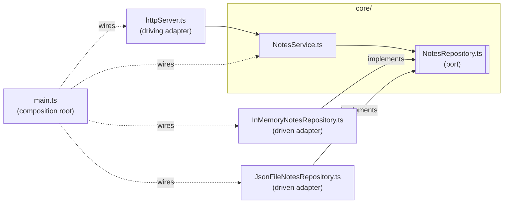

# notes-hexagonal — ports & adapters, as small as it gets

The same notes API as `../example-node/` (same endpoints, same `curl`
commands), rebuilt as **ports & adapters**. The core owns an interface — the
**port** — and everything outside the core **adapts** to it. Zero npm
dependencies, no build step.

## Run it

From this folder:

```bash
docker compose up --build
```

```bash
curl localhost:3000/notes
curl localhost:3000/notes/1
curl -X POST localhost:3000/notes \
  -H 'Content-Type: application/json' \
  -d '{"title":"hello","body":"first note"}'
```

Swap the storage adapter — no code change, just configuration read by the
composition root:

```bash
NOTES_STORE=file docker compose up --build
```

Stop with `Ctrl-C`, clean up with `docker compose down`.

## The pieces

```
src/
├── core/                              ← the hexagon
│   ├── NotesRepository.ts             ← PORT: interface owned by the core
│   └── NotesService.ts                ← CORE: the rules; imports only the port
├── adapters/                          ← everything outside the hexagon
│   ├── httpServer.ts                  ← DRIVING adapter: HTTP → core
│   ├── InMemoryNotesRepository.ts     ← DRIVEN adapter: implements the port
│   └── JsonFileNotesRepository.ts     ← DRIVEN adapter: implements the port
└── main.ts                            ← COMPOSITION ROOT: wires it all together
```



Every solid arrow is an `import`, and every one points **into** `core/`.

## Verify the rule

```bash
grep -rn "^import" src/core
```

The only hit is `NotesService.ts` importing `./NotesRepository.ts`. The core
knows nothing about HTTP, files or memory. Now look at an adapter:

```bash
grep -rn "^import" src/adapters
```

Every adapter imports from `../core/`. That's the arrow flipped compared to
`../example-node/`, where presentation imported persistence directly.

## Compared with `../example-node/`

| Question                             | example-node (layered)                  | example-hexagonal                               |
|--------------------------------------|-----------------------------------------|-------------------------------------------------|
| Who defines the storage contract?    | Nobody explicitly — it's whatever `notesRepository.js` happens to export | The core, as the `NotesRepository` interface |
| Which way does the storage import go? | presentation → persistence             | adapter → core                                  |
| Where is the storage chosen?         | a `require` line inside `server.js`     | `main.ts` only                                  |
| Where does validation live?          | in the HTTP handler                     | in the core (`NotesService`)                    |

## Why TypeScript?

A port is an interface, and plain JavaScript has no way to write one down. In
TypeScript the port is a real file (`NotesRepository.ts`), and every adapter
says `implements NotesRepository` — so the dependency on the port shows up in
the imports, where `grep` can see it.

Node 24 runs `.ts` files directly (it strips the types), so there is still no
compiler and no build step. The price: only type syntax that can simply be
deleted is allowed — which is why the classes assign their fields explicitly
instead of using constructor shorthand.

## What this example does *not* do

- **No database.** The two driven adapters are memory and a JSON file — enough
  to show the swap without any extra containers.
- **No tests.** Testing the core with a fake adapter is one of the in-class
  exercises.
- **No port on the driving side.** `httpServer.ts` calls `NotesService`
  directly. A stricter style would put an interface there too — the driven
  side carries the lesson.
