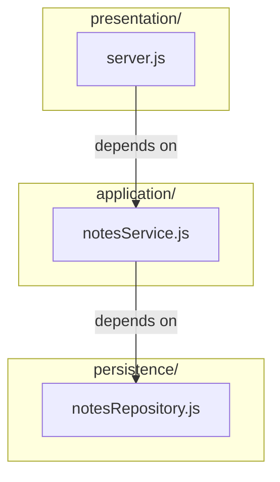
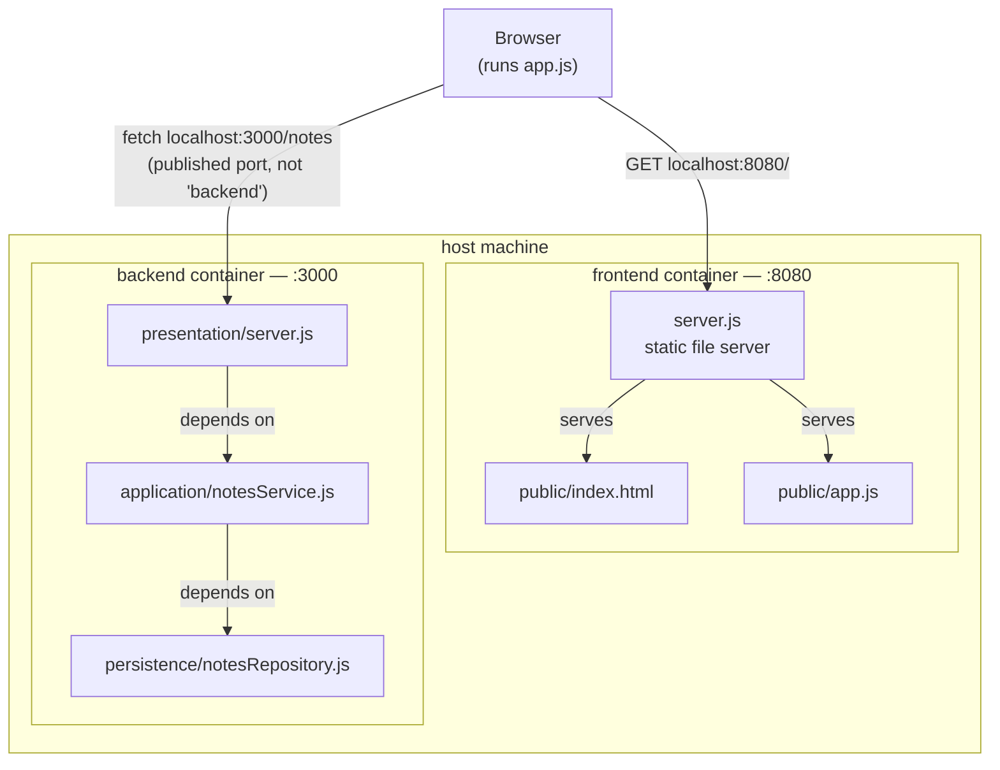

# notes-layered (Node.js) — three layers, one rule each

Stripped down further than the Kotlin and Python siblings in `../../08._layered_architecture/example-kotlin/`
and `../../08._layered_architecture/example-python/`: **three layers** (presentation, application,
persistence — no separate domain layer), **zero npm dependencies** (Node's built-in `http`
module, no Express), and **two separate Docker images** — a backend and a
frontend that reads from it. Use this one when you want the dependency-rule
story with nothing else competing for attention.

## Run it

From this folder:

```bash
docker compose up --build
```

Then open `http://localhost:8080` in a browser — the frontend fetches
`http://localhost:3000/notes` from the backend and renders the list.

Or talk to the backend directly:

```bash
curl localhost:3000/notes
curl localhost:3000/notes/1
curl -X POST localhost:3000/notes \
  -H 'Content-Type: application/json' \
  -d '{"title":"hello","body":"first note"}'
```

Stop with `Ctrl-C`, clean up with `docker compose down`.

## Backend endpoints

The backend listens on `http://localhost:3000`. Every response is JSON.

| Method | Path          | Request body                          | Success                        | Errors |
|--------|---------------|---------------------------------------|--------------------------------|--------|
| `GET`  | `/notes`      | —                                     | `200` — array of all notes     | — |
| `GET`  | `/notes/:id`  | —                                     | `200` — one note               | `404` `{"error":"Note not found"}` |
| `POST` | `/notes`      | `{"title": "...", "body": "..."}`     | `201` — the created note       | `400` `{"error":"title and body are required"}`, `400` `{"error":"Invalid JSON body"}` |

A note looks like `{"id": 1, "title": "Welcome", "body": "..."}`, with a numeric
`id`. Any other method or path returns `404` `{"error":"Not found"}`.

## The three layers (backend)

```
backend/
└── src/
    ├── presentation/
    │   └── server.js           ← receives HTTP requests, renders JSON
    ├── application/
    │   └── notesService.js     ← sits in between; owns one rule (see below)
    └── persistence/
        └── notesRepository.js  ← hardcoded data — see below
```

| Layer             | Depends on    | Knows nothing about           |
|-------------------|---------------|-------------------------------|
| `presentation/`   | `application` | `persistence`                 |
| `application/`    | `persistence` | `presentation`                |
| `persistence/`    | —             | `application`, `presentation` |



Verify by running:

```bash
grep -rn "require(" backend/src
```

You'll find exactly two cross-layer imports: `presentation/server.js`
requiring `../application/notesService`, and `application/notesService.js`
requiring `../persistence/notesRepository`. Each layer only knows the one
directly below it — presentation never reaches past the application layer
into persistence, and nothing requires upward. Those two lines are the entire
dependency rule for this example.

## What the application layer does

Almost nothing — on purpose. `findAll()` and `findById()` are hollow: they
pass the call down to persistence and hand the data straight back up. Only
`create()` has behaviour of its own:

```js
async function create(title, body) {
  return notesRepository.create(title.trim(), body.trim());
}
```

Notes are stored without leading or trailing whitespace — **whichever
persistence layer is underneath.** That's the point of the layer: a rule that
isn't about HTTP (so it doesn't belong in presentation) and isn't about
storage (so it doesn't belong in persistence) finally has a home.

Try it:

```bash
curl -X POST localhost:3000/notes \
  -H 'Content-Type: application/json' \
  -d '{"title":"   hello   ","body":"  first note  "}'
```

The note comes back as `"hello"` / `"first note"`.

There's still no separate **domain** layer (Session 8, Part 1's fourth
layer). With one rule, splitting "orchestration" from "business rules" would
be ceremony without content.

## The persistence layer is hardcoded — on purpose

`notesRepository.js` returns data from a plain in-memory array, not a
database. That's a **development-only stand-in**, explicitly commented as
such in the file. It exposes exactly three **async** functions — `findAll()`,
`findById(id)`, and `create(title, body)` — and that's the whole contract
`application/notesService.js` depends on.

Why async when nothing here waits on anything? Because a database or an HTTP
API *does* — its calls return Promises. If the contract were synchronous,
swapping in a real persistence layer would force the layer above to change
too (every call would need an `await`). Making the contract async from day
one is what lets the application layer stay untouched.

**Left out, on purpose:** a second persistence layer that reads from a real
database. Swapping one in means writing a new file that exposes the same
three async functions and changing the single `require(...)` line at the top
of `application/notesService.js` to point at it — nothing else changes, and
`presentation/server.js` isn't touched at all. That's
the same "swap Postgres for MySQL... in theory" claim from Session 8, Part 3,
set up so it can actually be tested against this codebase. (Session 9's
exercise does exactly that — twice.)

## Backend and frontend as separate Docker images

`docker-compose.yml` builds two independent images — `backend/` and
`frontend/` — each with its own `Dockerfile`, each exposing its own port.
Neither has a build step or a framework: the frontend is one HTML file, one
JS file, and a ~20-line static file server.



The frontend container never talks to the backend container directly — it only ever serves static files. Every arrow that reaches the backend starts at the browser, not at the frontend container. That's the point of the gotcha below.

**The gotcha worth walking through in class:** `frontend/public/app.js` calls
`http://localhost:3000`, not `http://backend:3000`. That's not a mistake.
`app.js` runs *inside the user's browser*, not inside the frontend
container — the browser has never heard of the Docker network's internal
service names, so it has to use the port published to the host. Compare that
to server-side inter-container calls (like the ones in Session 5), which *do*
use the service name. Same Docker Compose file, two different rules,
depending on which side of the network boundary the code actually runs on.

## What this example does *not* do

- **No domain layer.** See above — one rule doesn't justify a fourth layer.
- **No database.** The persistence layer is hardcoded; see above.
- **No tests.** A natural follow-up: stub `notesRepository` and test
  `notesService.create()`'s trimming in isolation.
- **No build step for the frontend.** Plain HTML and vanilla JS, on purpose —
  a bundler would be one more thing standing between the dependency rule and
  the screen.
- **No PUT/DELETE.** `GET /notes`, `GET /notes/:id`, and `POST /notes` only —
  enough to demonstrate the layers without building out full CRUD.

## Troubleshooting

- **Port 3000 or 8080 already in use** — change the relevant `ports` line in
  `docker-compose.yml`.
- **Frontend loads but the list stays empty** — open the browser console;
  a `Failed to fetch` almost always means the backend container isn't up yet,
  or `localhost:3000` is blocked/remapped. `docker compose ps` to check both
  containers are running.
