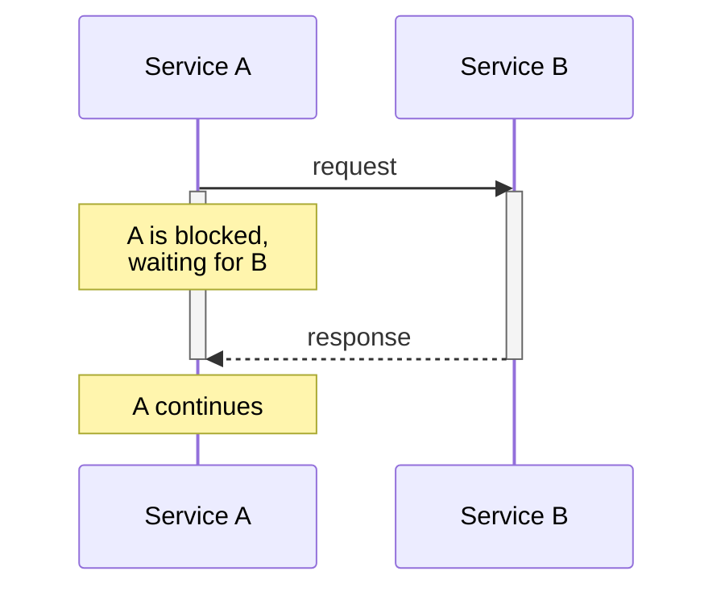
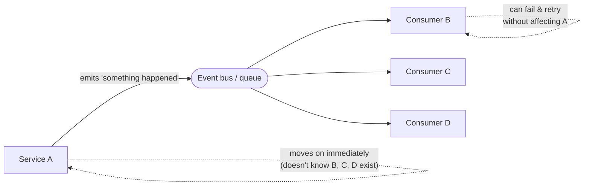
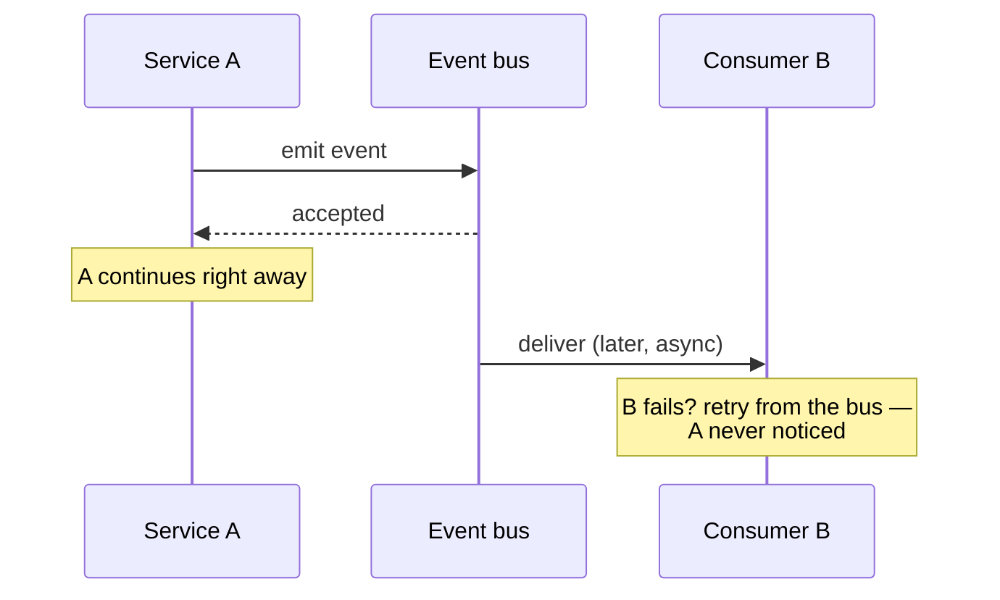

# Session 16: Event-Driven Architecture

**ITA Software Architecture 2026 Fall | 3 hours**

> Instead of "service A calls service B and waits," service A *announces* that something happened, and anything that cares reacts. S15 left us on the edge of this: a cached value goes stale the moment someone pushes — "invalidate on push" is *reacting to an event*. Today we generalise that, and read a real one — **Gitea's** internal queue (one interface, three broker backends) and the event fan-out that carries a repo push all the way out to a webhook.

---

## Learning Goals

- Distinguish request/response, message queue, and pub/sub — and say which problems each makes easier or harder.
- Read a real **queue port and its broker adapters** — in-memory → embedded → distributed.
- Trace a real **event end to end**: emit → internal fan-out → asynchronous delivery.
- Reason about **delivery and ordering guarantees**, retries, and dead-lettering.
- Recognise the **outbox** problem and event-sourcing / CQRS at a high level.

---

## Before Class

- Have **Gitea** (v1.26.2) cloned/browsable — same codebase we've read since S11.
- Bring your S15 caching deliverable. The cached commit count that's wrong after a push is today's starting point: that push is an **event**.
- [optional] One feature in a system you use that you suspect is async (a confirmation email, an export, a notification).

---

## Today's Teachings

### Part 0 — From cache invalidation to events (10 min)
Pick up where S15 ended. Gitea's cached commit count (`CacheRef`) is wrong the instant someone pushes; the fix is to *invalidate on push*. That's an event in disguise — something happened, and code reacts. In pairs: name one other "X happened, so Y should follow" in a system you've built. Two pairs share. Today we hold yours up against a real event system.

### Part 1 — The shift in mindset (25 min)
- **Request/response:** A calls B, A waits. The call stack *is* the control flow. A is coupled to B: it must know B exists, and if B is slow or down, A is slow or down too.

- **Event-driven:** A emits an event; the world reacts. A doesn't need to know B exists, and B can fail without crashing A.

Same handoff as a sequence — note that A returns *before* the work happens:

- **The trade:** you buy decoupling and resilience; you pay in operational complexity and traceability — "where did my call stack go?" Tracing one request across async hops is an observability problem (the kind a DevOps course picks up); here, just notice you've traded a readable stack trace for it.

### Part 2 — Messaging primitives (25 min)
- **Message queue** (RabbitMQ, SQS): one producer, one of N consumers — work distribution.
- **Pub/sub** (Kafka, SNS, Redis streams): one producer, many consumers — fan-out.
- **At-least-once vs "exactly-once"** delivery — what each really promises (and why "exactly-once" is mostly at-least-once + idempotent consumers — callback to S10's idempotency).
- **Ordering** — usually partition-scoped, not global.
- **Dead-letter queues** — where a message goes when it can't be processed, so one poison message doesn't wedge the pipe.

### Part 3 — Back in Gitea: one queue port, three brokers (35 min) — the set-piece
Open `modules/queue/base.go`. The `baseQueue` interface **is the port** — push an item, pop an item, in terms the rest of Gitea understands, with no mention of Redis or files. Three adapters implement it:

- `base_channel.go` — an in-memory Go channel. Fast, zero setup, **lost on restart** — dev / single instance.
- `base_levelqueue.go` — embedded LevelDB on disk. **Survives a restart**, still single-node.
- `base_redis.go` — a Redis list. **Shared across instances** — the distributed broker.

Same interface, swap by config — **ports and adapters again (S9)**, but this time the adapters are *message brokers*, and the "second adapter that makes it real" is the one you can't fake with a CLI: a distributed queue. `manager.go` and `workerqueue.go` wire worker pools onto the port.

Ask your agent: *"What does each of Gitea's three queue backends give you — persistence, sharing across instances — and when would you pick each?"* Then open the three files and check.

### Part 4 — A real event, end to end (25 min) — set-piece 2
Now trace one event from the inside out. Something happens on a repo (say, a push). Gitea announces it through an **internal fan-out**:

- `services/notify/notifier.go` — the `Notifier` interface: the internal pub/sub port. Many consumers register against it.
- Consumers react: `services/feed/notifier.go` writes the activity feed; `services/webhook/notifier.go` decides which webhooks should fire.
- `services/webhook/webhook.go` **enqueues** the delivery (it imports `modules/queue` — Part 3's queue, used for real); `services/webhook/deliver.go` does the actual HTTP delivery **asynchronously**, off the request path.
- Per-provider adapters format the *same* event for each target: `discord.go`, `slack.go`, `dingtalk.go`, `msteams.go`, `telegram.go`. One event, many shapes — pub/sub fan-out made concrete.

So the push from S15's cache invalidation is the same push that, traced outward, becomes a queued, asynchronously delivered webhook. One event, two reactions.

### Part 5 — Patterns at a glance (20 min)
- **Outbox** — the only safe way to "save to the DB *and* publish an event" atomically. Note the gap it closes: Gitea's queue can persist (levelqueue/redis) so an enqueued job survives a crash, but persisting the queue doesn't make the *save-and-enqueue pair* atomic — that's the outbox's job.
- **Event sourcing** — store the events; derive state by replay.
- **CQRS** — separate the read model from the write model.

Conceptual today; deep dives are another course. The point is to recognise them when you meet them.

### Part 6 — Sync or async? + synthesis (20 min)
For each, decide sync / async / hybrid and defend it: user registration; posting a tweet; charging a credit card; sending the welcome email *after* registration; generating a monthly report.

The thread forward: events are how decoupled parts coordinate without calling each other. **S17 (microservices vs monoliths)** is what happens when those event-connected parts also become *independently deployable* — and what that costs.

---

## Exercise

Take one feature from your session 10–15 work that would be better async. Half a page:

- Sketch the event flow: **who emits, who consumes, what happens on failure**.
- Which of Gitea's three queue backends (`channel` / `levelqueue` / `redis`) would you run for it, and **why**?
- What's your **retry / dead-letter** story if a consumer is down when the event fires?

Bring it to session 17.

---

## Investigation (after class)

Ask your agent, **verify against Gitea's code**, write it up. Pick **two** of the three.

### Prompt 1 — One port, three brokers
> "Compare Gitea's queue backends in `modules/queue/` — `base_channel`, `base_levelqueue`, `base_redis`. What does each give you (persistence, sharing across instances)? Which would you run on a single node vs a multi-node deployment?"

**Verify:** open the three files and `base.go`. Is the agent's persistence/sharing claim visible in the code? Which file would you point at to prove the in-memory one is lost on restart?

### Prompt 2 — Trace an event
> "In Gitea, trace a repo event to a webhook delivery: how does `services/notify` fan out, where does `services/webhook` enqueue the work, and what does `services/webhook/deliver.go` do off the request path?"

**Verify:** open the files. What runs synchronously (on the user's request) and what is handed to the queue? Name the line where it goes async.

### Prompt 3 — What happens on failure
> "If a webhook's target endpoint is down, what does Gitea do — retry, drop, dead-letter? Find it in `services/webhook/` and `modules/queue/`."

**Verify:** open `webhook.go`'s `handler` and see what it returns for items it didn't finish. How does the queue treat a returned (unhandled) item? Is that a retry?

### Deliverable

Half a page:

- **What I investigated** — which two prompts.
- **One claim the agent got right** — and the file/symbol that proves it.
- **One claim that was vague, wrong, or oversold** — and how you checked.
- **One sync-vs-async trade-off** — in your own words: something event-driven made easier, and something it made harder.

Bring it to session 17. First 10 minutes we compare.

---

## Optional

- [optional] Stopford, B. — *Designing Event-Driven Systems* (free O'Reilly book from Confluent).
- [optional] Fowler, M. — *What do you mean by "Event-Driven"?* — untangles the four things people mean by the term.
- [optional] Skim Gitea's `modules/queue/` package docs on how `baseQueue` and the worker pool fit together.
